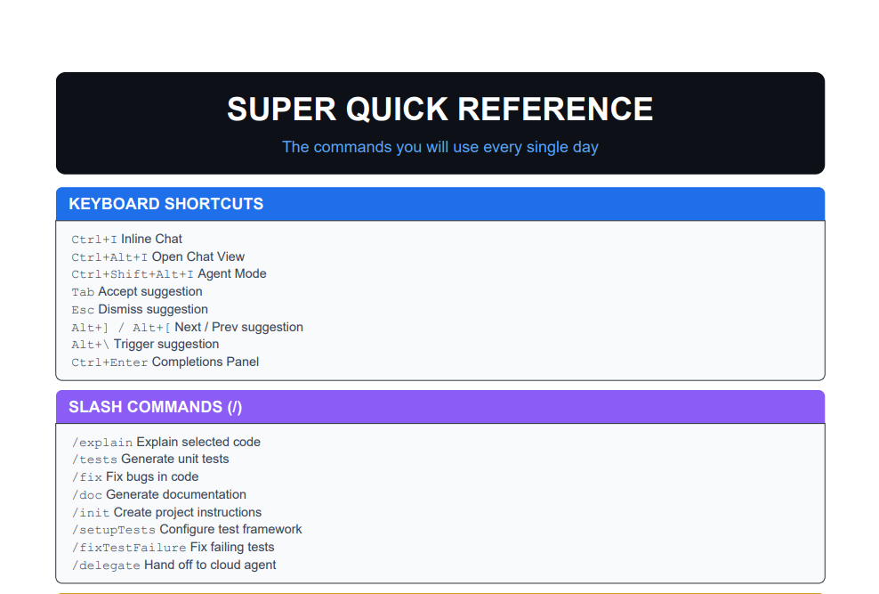

# GitHub Copilot Complete Cheat Sheet


A practical **developer-focused cheat sheet for GitHub Copilot** covering everyday workflows, agent usage, prompt patterns, and IDE integrations.

Supports:

* VS Code
* Android Studio
* JetBrains IDEs
* Copilot CLI
* Coding Agents
* Prompt Engineering

---

## Preview



---

## Download

📄 **Download the PDF**

👉 https://github.com/RakeshGowdaR/copilot-cheat-sheet/blob/main/pdf/github-copilot-cheatsheet.pdf

---

## Contents

1. Super Quick Reference
2. Real Developer Workflow
3. Configure Copilot for Your Repository
4. Keyboard Shortcuts
5. Slash Commands
6. Chat Participants
7. Context Variables
8. Chat Modes
9. Agent Sessions
10. Code Review Actions
11. Testing with Copilot
12. Customization & Instructions
13. MCP Servers
14. IDE Integration (JetBrains / Android Studio)
15. Copilot CLI
16. Plans & Pricing
17. Quick Reference Card
18. Advanced Copilot Workflows
19. Feature Availability Notes
20. Ready-to-Use Prompt Patterns

---

## Super Quick Reference

### Keyboard Shortcuts

| Shortcut               | Action                     |
| ---------------------- | -------------------------- |
| Ctrl + I               | Inline Chat                |
| Ctrl + Alt + I         | Open Chat View             |
| Ctrl + Shift + Alt + I | Agent Mode                 |
| Tab                    | Accept suggestion          |
| Esc                    | Dismiss suggestion         |
| Alt + ] / Alt + [      | Next / Previous suggestion |
| Alt + \                | Trigger suggestion         |
| Ctrl + Enter           | Open completions panel     |

---

### Slash Commands

| Command           | Description                  |
| ----------------- | ---------------------------- |
| `/explain`        | Explain selected code        |
| `/tests`          | Generate unit tests          |
| `/fix`            | Suggest bug fixes            |
| `/doc`            | Generate documentation       |
| `/init`           | Create project instructions  |
| `/setupTests`     | Configure test framework     |
| `/fixTestFailure` | Fix failing tests            |
| `/delegate`       | Hand off task to cloud agent |

---

### Context Variables

| Variable               | Description                |
| ---------------------- | -------------------------- |
| `#file:name`           | Specific file              |
| `#selection`           | Selected code              |
| `#changes`             | Uncommitted changes        |
| `#testFailure`         | Failing test output        |
| `#codebase`            | Entire codebase            |
| `#sym:name`            | Specific function or class |
| `#fetch:URL`           | Include webpage content    |
| `#terminalLastCommand` | Last terminal output       |

---

### Chat Participants

| Participant  | Purpose                   |
| ------------ | ------------------------- |
| `@workspace` | Entire codebase knowledge |
| `@github`    | GitHub repos, issues, PRs |
| `@terminal`  | Shell commands & errors   |
| `@vscode`    | Editor configuration      |

---

## Golden Copilot Workflow

Most developers follow this flow when building features with Copilot:

```
/init → Plan → Agent → Review #changes → Create PR
```

1. Initialize repository instructions
2. Plan feature implementation
3. Let Agent implement and test
4. Review changes
5. Create pull request

---

## Real Developer Workflow

Example: Build a complete feature using Copilot.

### Step 1 — Initialize the Repository

```
/init
```

Creates `.github/copilot-instructions.md` based on your project structure.

---

### Step 2 — Plan the Feature

Use **Plan mode**:

```
Implement OAuth2 authentication with Google and GitHub providers
JWT refresh tokens
Role-based access control
```

Review the plan before approving.

---

### Step 3 — Let Agent Implement

Copilot Agent can:

* create files
* install dependencies
* implement logic
* update configuration

---

### Step 4 — Run Tests

```
/tests using Jest
```

Agent runs tests, reads failures, and iterates until they pass.

---

### Step 5 — Review Changes

```
@workspace review #changes
```

Check for:

* security issues
* performance problems
* naming conventions
* missing error handling

---

### Step 6 — Create PR

```
/delegate create PR with feature, tests, and docs
```

Copilot creates branch and pull request automatically.

---

## Configure Copilot for Your Repository

Create these files to improve Copilot output:

```
.github/
│
├── copilot-instructions.md
├── prompts/
├── skills/
├── agents/
AGENTS.md
```

### Example `copilot-instructions.md`

```
Language: TypeScript strict mode
Naming: camelCase variables, PascalCase types
Testing: Jest for unit tests
Error handling: try/catch for async operations
```

These rules guide Copilot when generating code.

---

## Prompt Patterns

Copy and paste these into Copilot Chat.

### Refactor Code

```
@workspace refactor #file:user_service.ts
to follow repository patterns and improve error handling
```

---

### Generate Tests

```
/tests for #selection
using JUnit5 and Mockito
cover edge cases and error paths
```

---

### Review Changes

```
@workspace review #changes for:
- security vulnerabilities
- performance issues
- naming conventions
- missing error handling
```

---

### Debug an Issue

```
@workspace the API returns 500 when creating a user
with special characters in the name field

#file:user_controller.ts
#file:user_model.ts
```

---

### Generate API Endpoint

```
@workspace create a REST endpoint in #file:routes.ts
for CRUD operations on "products"
following the same patterns as the existing users endpoints
```

---

## Why This Cheat Sheet Exists

Most Copilot guides focus on **features**.

This cheat sheet focuses on **real workflows developers use daily**:

* prompt engineering
* agent workflows
* repository configuration
* practical examples

Everything in one place.

---

## Repository Structure

```
copilot-cheat-sheet
│
├── README.md
├── pdf/
│   └── github-copilot-cheatsheet.pdf
│
├── images/
│   └── preview.png
│
├── markdown/
│   └── copilot-cheatsheet.md
│
└── examples/
    ├── prompt-patterns.md
    └── repo-setup.md
```

---

## Contributing

Pull requests are welcome.

You can contribute:

* new prompt patterns
* IDE tips
* Copilot workflows
* CLI examples
* documentation improvements

Open an issue to suggest improvements.

---

## License

MIT License

---

## Star the Project

If this cheat sheet helped you, consider giving it a ⭐.

It helps other developers discover the resource.
